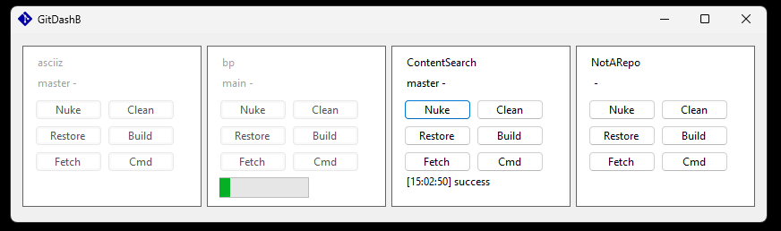

## Introduction

Gitdashb is an application to allow basic management of multiple git repositories for NET projects.

## Download

Compiled downloads are not available.

## Compiling

To clone and run this application, you'll need [Git](https://git-scm.com) and [.NET](https://dotnet.microsoft.com/) installed on your computer. From your command line:

```
# Clone this repository
$ git clone https://github.com/btigi/gitdashb

# Go into the repository
$ cd src

# Build  the app
$ dotnet build
```

## Usage

Repository information is read from repos.json. A repository node has the following elements:

- Name - the name of the repository, to be displayed in gitdashb
- GitDirectory - the root directory of the repository
- SlnDirectory - the directory within the repository containing the NET solution file
- GoldenBranch - unused
- Group - an integer used to group solutions contained with the same repository together
- Remote - the name of the git remote
- SourceUrl - the url of the remote git repository (ending in .git)
- SourceUsernameEnvVar - the name of the machine environment variable containing the username required to access the remote git repository
- SourcePasswordEnvVar - "the name of the machine environment variable containing the password / access token required to access the remote git repository

While running a panel is created for each repository, displaying the name and current branch. For each repository the currently supported commands are:

- Nuke - undo pending git changes
- Clean - run a `dotnet clean` command
- Restore - run a `dotnet restore` command
- Build - run a `dotnet build` command
- Fetch - run a `git fetch` command
- Cmd - launch a command prompt with the working directory set to the repository solution directory
- Clone - clone the remote repository
- Run - run a `dotnet run` command

A progress bar is displaying while the operation is on-going and a success/failure result is displayed (based on the operation exit code)



## Licence

Gitdashb is licenced under the Mozilla Public License 2.0. A full copy of the licence is available in licence.md

## Acknowledgements

Gitdashb uses a modified version of the git logo, sourced from https://git-scm.com/downloads/logos under the Creative Commons Attribution 3.0 Unported License.

Gitdashb relies on LibGit2Sharp for git interactions, licenced under the MIT licence https://www.nuget.org/packages/LibGit2Sharp/0.30.0/license

Gitdashb relies on various Microsoft NET packages licenced as MIT https://licenses.nuget.org/MIT


-----

> [!WARNING]
> The project uses winforms. Sorry.